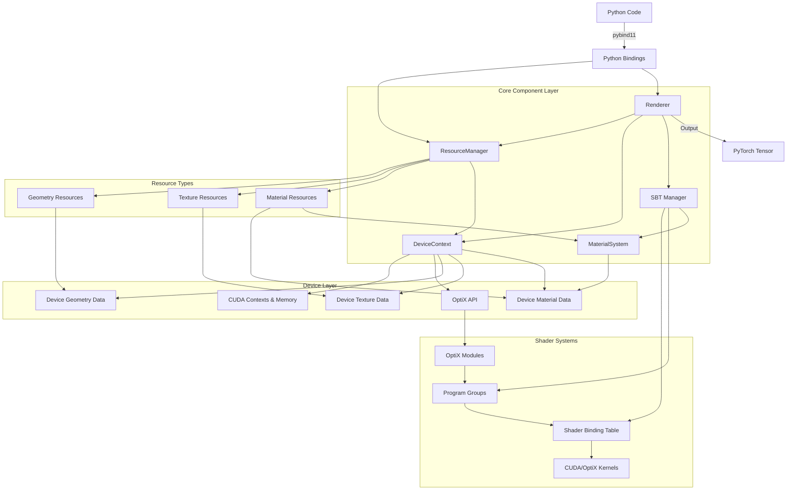

# OptiX Resource System Architecture

## Key Components:

1. **Python Interface Layer**
   - Managed through pybind11 bindings (`binding.cpp` & `PythonBindings.h`)
   - Exposes ResourceManager, Renderer, and GeometryInstance classes
   - Provides conversions between Python types and C++ types

2. **ResourceManager**
   - Central hub managing all resources (geometry, textures, materials)
   - Creates and tracks resource handles
   - Manages device contexts for multi-GPU support

3. **DeviceContext**
   - Handles device-specific operations
   - Initializes CUDA and OptiX contexts
   - Maps from generic resources to device-specific memory
   - Handles acceleration structure building

4. **Renderer**
   - Creates and manages the OptiX pipeline
   - Builds scene graph from geometry instances
   - Sets up camera and launch parameters
   - Executes OptiX rendering and returns PyTorch tensors

5. **MaterialSystem**
   - Implements IMaterialSystem interface
   - Manages material types, parameters, and textures
   - Handles device-specific material compilation
   - Provides material parameter data to OptiX shaders

6. **SBT Manager**
   - Creates shader binding table entries
   - Links geometry and materials to OptiX programs
   - Manages program groups for ray generation, miss, and hit programs

7. **Resource Types**
   - GeometryResource: Manages vertices, indices, and attributes
   - TextureResource: Handles image data for materials
   - MaterialResource: Defines surface properties and shading models

## Data Flow:

1. User creates resources via ResourceManager (geometry, textures, materials)
2. Resources are uploaded to GPU via DeviceContext
3. User creates GeometryInstance objects and configures scene
4. Renderer initializes OptiX pipeline and builds acceleration structures
5. SBTManager connects geometry and materials to their shader programs
6. Renderer executes OptiX kernel with configured parameters
7. Output is written directly to a PyTorch tensor and returned to Python

This architecture provides a high-level Python interface to the low-level OptiX ray tracing engine, with sophisticated resource management and material handling capabilities.